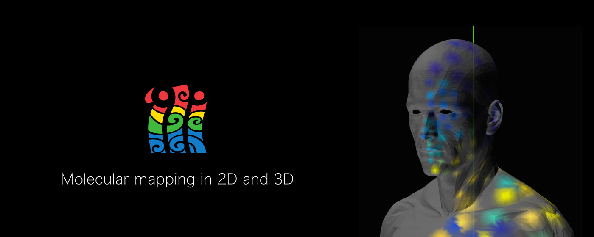
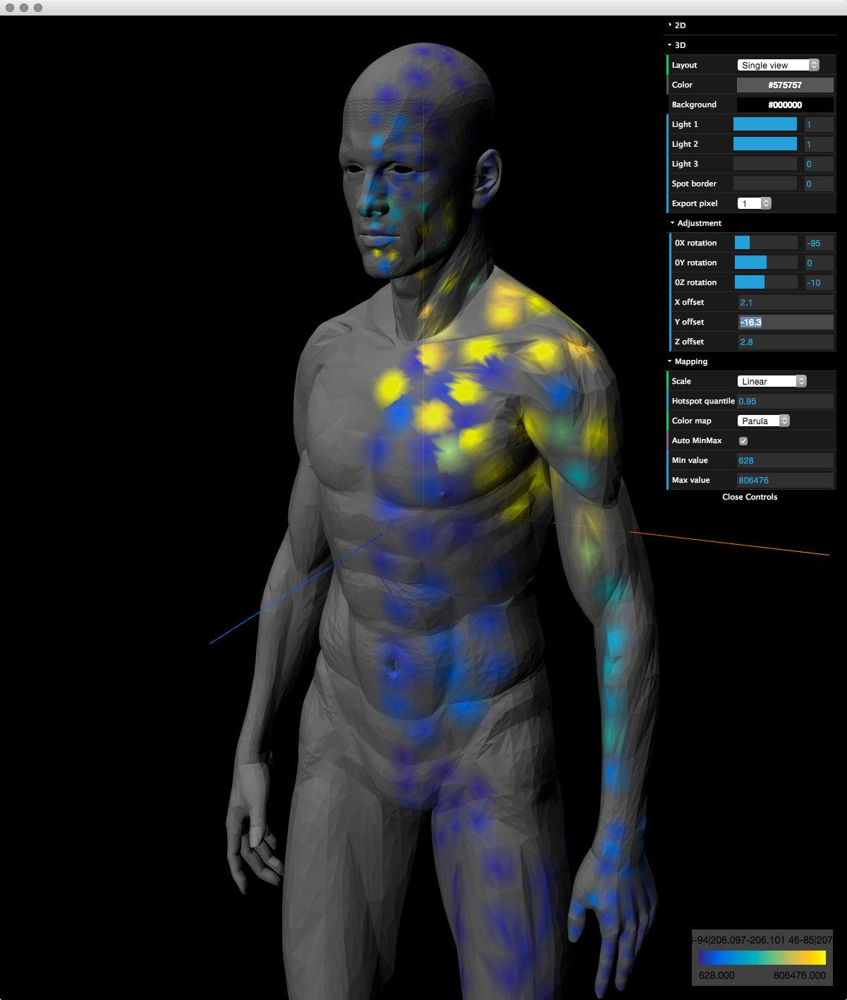
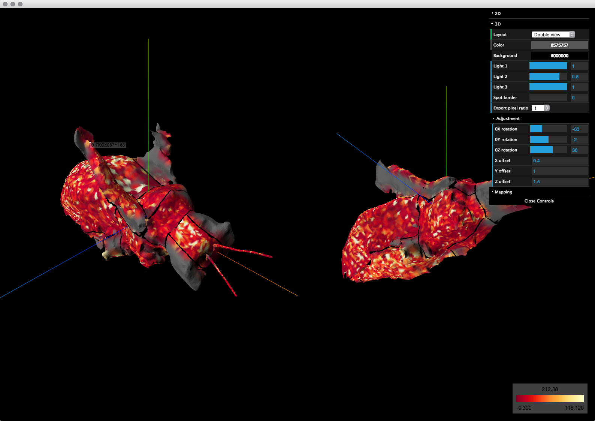
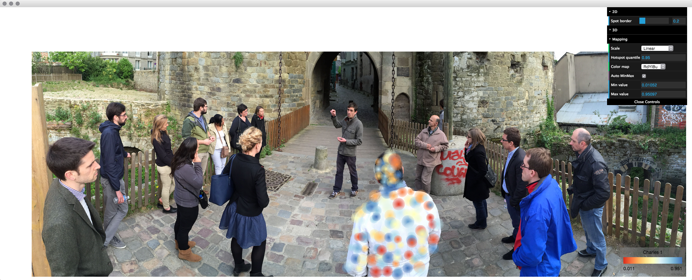

## 

`ili is a toolbox for 2D and 3D molecular mapping in Chrome.

`ili is being developed by [Alexandrov Team](http://www.embl.de/research/units/scb/alexandrov/index.html) at EMBL Heidelberg ([contact information](http://www.embl.de/research/units/scb/alexandrov/contact/index.html)).

* Developers: Ivan Protsyuk, Sergey Ryazanov
* Principal investigator: Theodore Alexandrov 

## Hello bee

For a demonstration, open in Google Chrome 
* [3D human skin metabolome example](http://ili-toolbox.github.io/?human/man.stl;human/man_LCMS_small.csv) from [the PNAS paper](#miscellaneous); zoom out by using the mouse wheel to see the full image and follow [instructions](#how-to-use-it)

&nbsp;&nbsp;&nbsp;&nbsp;&nbsp;&nbsp;&nbsp;

* [3D bee example](http://ili-toolbox.github.io/?bee/model.stl;bee/intensities.csv) (data provided by Yi Zeng from the Dorrestein Lab, UCSD); follow [instructions](#how-to-use-it)

&nbsp;&nbsp;&nbsp;&nbsp;&nbsp;&nbsp;&nbsp;

* [2D 3dmassomics visualisation example](http://ili-toolbox.github.io/?3dmassomics/bg.png;3dmassomics/intensities.csv) (a photo made during the 3D-MASSOMICS project meeting with simulated spots overlaid); zoom out by using the mouse wheel to see the full image and follow [instructions](#how-to-use-it)

&nbsp;&nbsp;&nbsp;&nbsp;&nbsp;&nbsp;&nbsp;

## Installation

The best ways of running `ili in Chrome are either [from this website](http://ili-toolbox.github.io/) or as a [Chrome App](https://goo.gl/wiQG5s).

## Input

`ili takes two files: 
* for 2D mapping: a PNG to be used as the background image ([example](https://raw.githubusercontent.com/ili-toolbox/ili/master/data/3dmassomics/bg.png)), and a CSV with intensities and coordinates ([example](https://raw.githubusercontent.com/ili-toolbox/ili/master/data/3dmassomics/intensities.csv))
* for 3D mapping: a binary STL of the 3D model ([example](https://raw.githubusercontent.com/ili-toolbox/ili/master/data/bee/model.stl)), and a CSV with intensities and coordinates ([example](https://raw.githubusercontent.com/ili-toolbox/ili/master/data/bee/intensities.csv))

## Demo

You can find a pop-down list of ready-made examples at the top-left corner of \`ili window. Click any of them, and necessary files will be loaded to the app automatically.

## How to use it?

One of the fundamental ideas behind the `ili interface is the simplicity of usage. Therefore, some operations can be performed with keyboard shortcuts.

|Action|Shortcut on Windows, Linux|Shortcut on OS X|Alternative|
|------|--------------------------|----------------|-----------|
|Open files|<kbd>Ctrl</kbd>+<kbd>O</kbd>|<kbd>⌘</kbd>+<kbd>O</kbd>|Drag and drop files to \`ili window. Also, when you just launched \`ili, you can press `Open` button at the center of the window.|
|Switch between molecular maps|<kbd>Ctrl</kbd>+<kbd>↑</kbd>, <kbd>Ctrl</kbd>+<kbd>↓</kbd>|<kbd>⌘</kbd>+<kbd>↑</kbd> , <kbd>⌘</kbd>+<kbd>↓</kbd>|Click on a name of an active map above a colorbar at the right-bottom corner of an app window and select another map with mouse.|
|Find a molecular map by its name|<kbd>Ctrl</kbd>+<kbd>F</kbd>|<kbd>⌘</kbd>+<kbd>F</kbd>|Click on a name of an active map above a colorbar at the right-bottom corner of an app window and start typing.|
|Make a snapshot|<kbd>Ctrl</kbd>+<kbd>S</kbd>|<kbd>⌘</kbd>+<kbd>S</kbd>|NA

Many other controls for adjusting visualization are available in a pop-down menu at the top-right corner of `ili window. Three main sections there "2D", "3D" and "Mapping" correspond to settings affecting 2D/3D views and colormaps.

Mouse buttons can be used to adjust point of view on a model/picture.

|Action|Mouse button|Views where available|
|------|------------|---------------------|
|Rotate model|Move mouse holding its left button|3D|
|Move image|Move mouse holding its left button|2D|
|Zoom|Rotate mouse wheel|2D, 3D|
|Display spot name|Click at a spot with left button|2D, 3D|
|Move model|Move mouse holding its right button|3D|
|Enable/disable model auto-rotation|Double-click|3D|

## Any questions?

Feel free to leave your questions and suggestions at ["Support" section](https://goo.gl/fUTQrg) on the `ili page at Google web store.

## How to stay updated

Please sign up to the mailing list by sending an email to ili-toolbox+subscribe@googlegroups.com

## Miscellaneous

* **Why is it called `ili?** `ili in Hawaiian means skin and, among others, surface, area, or cover.
* **How to record videos or screencasts in `ili?** Please use a third-party software, for example ScreenCastify plugin to Chrome
* **How can I cite `ili in my scientific publication?** We haven't published a paper devoted to \`ili yet, so please cite [*Bouslimani et al. (2015) PNAS*](http://www.pnas.org/content/112/17/E2120.abstract?sid=3ff11025-6bea-4b97-808e-0b4d49b7f837), our publication which motivated us the create and release \`ili.

## Funding

This project is funded from the European Union project [3D-MASSOMICS](http://3d-massomics.eu/) (FP7 HEALTH program, grant agreement no. 305259).
