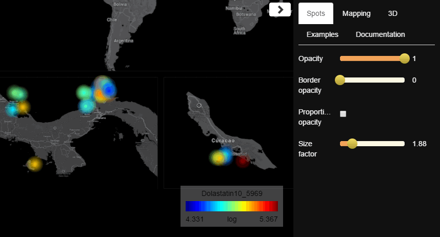

## 

`ili is a toolbox for 2D and 3D molecular mapping.

`ili is being developed mainly by [Alexandrov Team](http://www.embl.de/research/units/scb/alexandrov/index.html) at EMBL Heidelberg ([contact information](http://www.embl.de/research/units/scb/alexandrov/contact/index.html)) in collaboration with the [Dorrestein Lab](http://dorresteinlab.ucsd.edu/Dorrestein_Lab/Welcome.html) and the [Knight Lab](https://knightlab.ucsd.edu/) at UCSD.

* Developers: Ivan Protsyuk, Sergey Ryazanov
* External contributors:
  * Members of [Knight lab](http://knightlab.ucsd.edu): Antonio Gonzalez, Jamie Morton, Jose Navas, Yoshiki Vázquez Baeza
* Principal investigator: Theodore Alexandrov 

## Hello bee

For a demonstration, open
* [3D human skin metabolome example](https://goo.gl/aMBzq8) from [the PNAS paper](#miscellaneous); zoom out by using the mouse wheel to see the full image and follow [instructions](#how-to-use-it)

&nbsp;&nbsp;&nbsp;&nbsp;&nbsp;&nbsp;&nbsp;

* [3D bee example](https://goo.gl/YyB3Te) (data provided by Yi Zeng from the Dorrestein Lab, UCSD); follow [instructions](#how-to-use-it)

&nbsp;&nbsp;&nbsp;&nbsp;&nbsp;&nbsp;&nbsp;

* [2D cyanobacteria distribution example](https://goo.gl/6CGCCK) (data provided by Tal Luzzatto from the Dorrestein Lab, UCSD); zoom out by using the mouse wheel to see the full image and follow [instructions](#how-to-use-it)

&nbsp;&nbsp;&nbsp;&nbsp;&nbsp;&nbsp;&nbsp;

## Examples from real-life studies

On [this page](./Studies.md) you can find examples of \`ili being applied in research.

## Installation

The best ways of running `ili are either [from this website](http://ili.embl.de/) or as a [Chrome extension](https://goo.gl/3KAA8U).

## Input

`ili takes two files:
* for 2D mapping: a PNG or JPG file to be used as the background image ([example](https://raw.githubusercontent.com/MolecularCartography/ili_file_server/master/data/cyano/bg.png)), and a mapping file with intensities and coordinates in CSV format ([example](https://raw.githubusercontent.com/MolecularCartography/ili_file_server/master/data/cyano/intensities.csv))
* for 3D mapping: a 3D model in STL format ([example](https://raw.githubusercontent.com/MolecularCartography/ili_file_server/master/data/bee/model.stl)), and a mapping file with intensities and coordinates in CSV format ([example](https://raw.githubusercontent.com/MolecularCartography/ili_file_server/master/data/bee/intensities.csv))

To create a mapping file suitable for input, you need two pieces of information: coordinates of your samples on your picture/model and intensities of features you're going to visualize in \`ili. Please find the instruction on how to create a CSV table with coordinates [here](https://github.com/alexandrovteam/Optimus/blob/master/Obtaining%20coordinates%20of%20sampling%20spots.md). Rows of the result table correspond to samples. Once you have it, you can add your features as new columns. Finally, you need to save it as a CSV file, and it is ready to be viewed in \`ili. Refer to the examples above to have an idea of the final look of the table.

## Cartographical snapshots

\`ili facilitates reproducible data analysis by providing the feature of cartographical snapshots: a complete copy of all visualization settings saved to a file. The file can be reused later or shared with other users, who, afterwards, will be able not only to recover the same view, but also use it as a starting point for further analysis.

The cartographical snapshot is a file in JSON format that can be opened in \`ili using drag&drop along with corresponding files of 3D model/image and spatial mapping.

## Demo

You can find a list of ready-made examples in the "Examples" tab in the \`ili sidebar. Click on any of them, and necessary files will be loaded to the app automatically.

## How to use it?

One of the fundamental ideas behind the `ili interface is the simplicity of usage. Therefore, most operations can be performed with keyboard shortcuts.

|Action|Shortcut on Windows, Linux|Shortcut on OS X|Alternative|
|------|--------------------------|----------------|-----------|
|Open files|<kbd>Ctrl</kbd>+<kbd>O</kbd>|<kbd>⌘</kbd>+<kbd>O</kbd>|Drag and drop files to \`ili window. Also, when you just launched \`ili, you can press `Open` button at the center of the window.|
|Switch between molecular maps|<kbd>Ctrl</kbd>+<kbd>↑</kbd>, <kbd>Ctrl</kbd>+<kbd>↓</kbd>|<kbd>⌘</kbd>+<kbd>↑</kbd> , <kbd>⌘</kbd>+<kbd>↓</kbd>|Click on a name of an active map above a colorbar at the right-bottom corner of an app window and select another map with mouse.|
|Find a molecular map by its name|<kbd>Ctrl</kbd>+<kbd>F</kbd>|<kbd>⌘</kbd>+<kbd>F</kbd>|Click on a name of an active map above a colorbar at the right-bottom corner of an app window and start typing.|
|Save view as image|<kbd>Ctrl</kbd>+<kbd>S</kbd>|<kbd>⌘</kbd>+<kbd>S</kbd>|NA
|Save cartographical snapshot|<kbd>Ctrl</kbd>+<kbd>E</kbd>|<kbd>⌘</kbd>+<kbd>E</kbd>|NA

Many other controls for adjusting visualization are available in the `ili sidebar. Three main sections there "2D", "3D" and "Mapping" correspond to settings affecting 2D/3D views and colormaps.

Mouse buttons can be used to adjust point of view on a model/picture.

|Action|Mouse button|Views where available|
|------|------------|---------------------|
|Rotate model|Move mouse holding its left button|3D|
|Move image|Move mouse holding its left button|2D|
|Zoom|Rotate mouse wheel|2D, 3D|
|Display spot name|Click at a spot with left button|2D, 3D|
|Move model|Move mouse holding its right button|3D|
|Enable/disable model auto-rotation|Double-click|3D|

## Any questions?

Feel free to leave your questions and suggestions as issues in this repository or at the ["Support" section](https://goo.gl/D8DH53) on the `ili page at Google web store.

## How to stay updated

Please sign up to the mailing list by sending an email to ili-toolbox+subscribe@googlegroups.com

## Miscellaneous

* **Why is it called \`ili?** \`ili in Hawaiian means skin and, among others, surface, area, or cover.
* **How to record videos or screencasts in `ili?** Please use a third-party software, for example ScreenCastify plugin to Chrome
* **How can I cite \`ili in my scientific publication?** We haven't published a paper devoted to \`ili yet, so please cite [*Bouslimani et al. (2015) PNAS*](http://www.pnas.org/content/112/17/E2120.abstract?sid=3ff11025-6bea-4b97-808e-0b4d49b7f837), our publication which motivated us the create and release \`ili.

## License

The content of this project is licensed under the Apache 2.0 licence, see LICENSE.md.

## Funding

This project is funded from the European projects [3D-MASSOMICS](http://3d-massomics.eu/) (FP7 HEALTH program, grant agreement no. 305259), [METASPACE](http://metaspace2020.eu/) (Horizon2020 program, grant agreement no. 634402) and from the internal funds of European Molecular Biology Laboratory.
